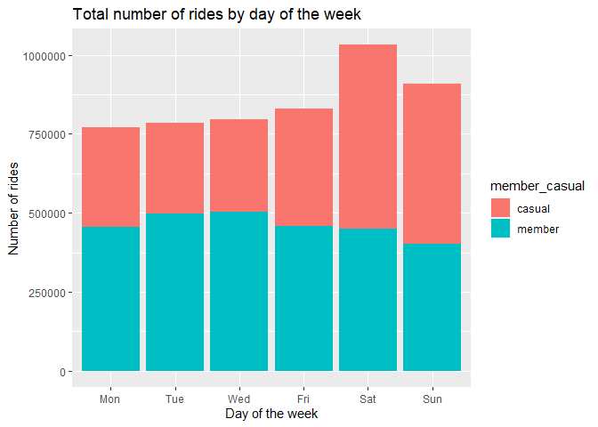
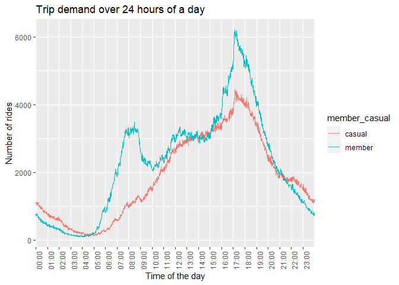
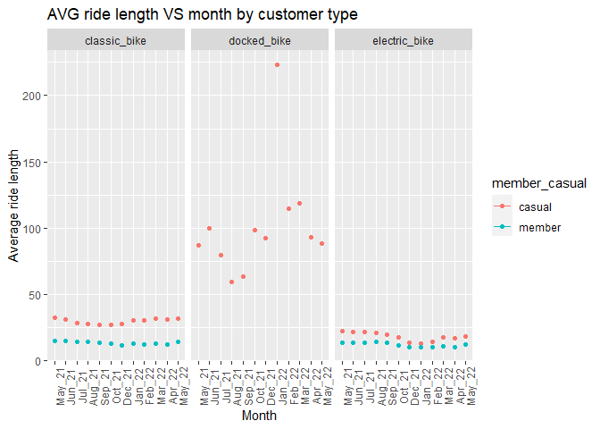
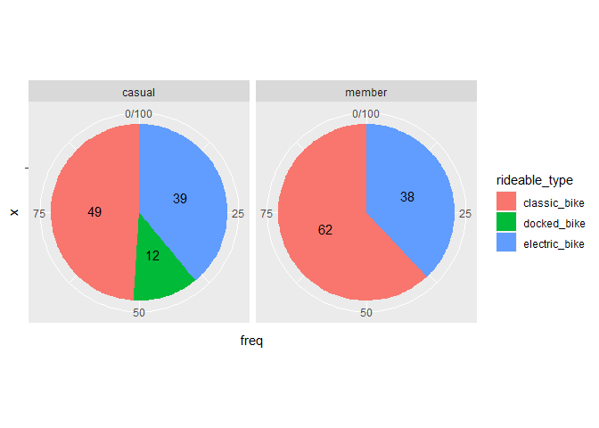

Capstone Project - Cyclistic bike-share
================
Ngoc Trang HA
2022-07-08

#### Introduction

This is the Cyclistic bike-share analysis case study, a project capstone
of Google Data Analytics brought by Coursera. It contains 3 of 6 steps
of data analysis which are Prepare-Analyze-Share.

(Note: The datasets have a different name because Cyclistic is a
fictional company. For the purposes of this case study, the datasets are
appropriate and will enable you to answer the business questions. The
data has been made available by Motivate International Inc. under this
[license](https://ride.divvybikes.com/data-license-agreement).)

#### Load packages

``` r
knitr::opts_chunk$set(message = FALSE)
library(dplyr)
```

    ## 
    ## Attaching package: 'dplyr'

    ## The following objects are masked from 'package:stats':
    ## 
    ##     filter, lag

    ## The following objects are masked from 'package:base':
    ## 
    ##     intersect, setdiff, setequal, union

``` r
library(tidyverse)
```

    ## ── Attaching packages ─────────────────────────────────────── tidyverse 1.3.1 ──

    ## ✔ ggplot2 3.3.6     ✔ purrr   0.3.4
    ## ✔ tibble  3.1.7     ✔ stringr 1.4.0
    ## ✔ tidyr   1.2.0     ✔ forcats 0.5.1
    ## ✔ readr   2.1.2

    ## ── Conflicts ────────────────────────────────────────── tidyverse_conflicts() ──
    ## ✖ dplyr::filter() masks stats::filter()
    ## ✖ dplyr::lag()    masks stats::lag()

``` r
library(tidyr)
library(readr)
library(lubridate)
```

    ## 
    ## Attaching package: 'lubridate'

    ## The following objects are masked from 'package:base':
    ## 
    ##     date, intersect, setdiff, union

``` r
library(ggplot2)
```

#### Import and rename datasets

``` r
trip052022 <- read.csv("202205-divvy-tripdata.csv")
trip042022 <- read.csv("202204-divvy-tripdata.csv")
trip032022 <- read.csv("202203-divvy-tripdata.csv")
trip022022 <- read.csv("202202-divvy-tripdata.csv")
trip012022 <- read.csv("202201-divvy-tripdata.csv")
trip122021 <- read.csv("202112-divvy-tripdata.csv")
trip112021 <- read.csv("202111-divvy-tripdata.csv")
trip102021 <- read.csv("202110-divvy-tripdata.csv")
trip092021 <- read.csv("202109-divvy-tripdata.csv")
trip082021 <- read.csv("202108-divvy-tripdata.csv")
trip072021 <- read.csv("202107-divvy-tripdata.csv")
trip062021 <- read.csv("202106-divvy-tripdata.csv")
trip052021 <- read.csv("202105-divvy-tripdata.csv")
```

#### Check column names and data types

This step is crucial because later we will need to merge datasets into
one, column names must be corresponding between datasets and so are the
data types

Since the last step shows that the column names and data types of
datasets are correct, now we create a list of datasets and then merge
them into one dataset. Plus, we need to create a name for that one
dataset and delete columns that are not neccessary for the analysis

``` r
df_list <- list(trip052022,trip042022,trip032022,trip022022,trip012022,trip122021,
                trip112021,trip102021,trip092021,trip082021,trip072021,trip062021,
                trip052021)
trip_05_2122 <- bind_rows(df_list)
trip_05_2122 <- trip_05_2122 %>% select(-c(start_lat:end_lng))
```

#### Data cleaning

Now we check the structure of the new dataset we just created

``` r
str(trip_05_2122)
```

    ## 'data.frame':    6392409 obs. of  9 variables:
    ##  $ ride_id           : chr  "EC2DE40644C6B0F4" "1C31AD03897EE385" "1542FBEC830415CF" "6FF59852924528F8" ...
    ##  $ rideable_type     : chr  "classic_bike" "classic_bike" "classic_bike" "classic_bike" ...
    ##  $ started_at        : chr  "2022-05-23 23:06:58" "2022-05-11 08:53:28" "2022-05-26 18:36:28" "2022-05-10 07:30:07" ...
    ##  $ ended_at          : chr  "2022-05-23 23:40:19" "2022-05-11 09:31:22" "2022-05-26 18:58:18" "2022-05-10 07:38:49" ...
    ##  $ start_station_name: chr  "Wabash Ave & Grand Ave" "DuSable Lake Shore Dr & Monroe St" "Clinton St & Madison St" "Clinton St & Madison St" ...
    ##  $ start_station_id  : chr  "TA1307000117" "13300" "TA1305000032" "TA1305000032" ...
    ##  $ end_station_name  : chr  "Halsted St & Roscoe St" "Field Blvd & South Water St" "Wood St & Milwaukee Ave" "Clark St & Randolph St" ...
    ##  $ end_station_id    : chr  "TA1309000025" "15534" "13221" "TA1305000030" ...
    ##  $ member_casual     : chr  "member" "member" "member" "member" ...

Notice that the column “started_at” and “ended_at” are still character
type, we need to transform it to the right data type which is datetime

``` r
trip_05_2122$started_at <- strptime(trip_05_2122$started_at,format="%Y-%m-%d %H:%M:%S")
trip_05_2122$ended_at <- strptime(trip_05_2122$ended_at,format="%Y-%m-%d %H:%M:%S")
str(trip_05_2122)
```

    ## 'data.frame':    6392409 obs. of  9 variables:
    ##  $ ride_id           : chr  "EC2DE40644C6B0F4" "1C31AD03897EE385" "1542FBEC830415CF" "6FF59852924528F8" ...
    ##  $ rideable_type     : chr  "classic_bike" "classic_bike" "classic_bike" "classic_bike" ...
    ##  $ started_at        : POSIXlt, format: "2022-05-23 23:06:58" "2022-05-11 08:53:28" ...
    ##  $ ended_at          : POSIXlt, format: "2022-05-23 23:40:19" "2022-05-11 09:31:22" ...
    ##  $ start_station_name: chr  "Wabash Ave & Grand Ave" "DuSable Lake Shore Dr & Monroe St" "Clinton St & Madison St" "Clinton St & Madison St" ...
    ##  $ start_station_id  : chr  "TA1307000117" "13300" "TA1305000032" "TA1305000032" ...
    ##  $ end_station_name  : chr  "Halsted St & Roscoe St" "Field Blvd & South Water St" "Wood St & Milwaukee Ave" "Clark St & Randolph St" ...
    ##  $ end_station_id    : chr  "TA1309000025" "15534" "13221" "TA1305000030" ...
    ##  $ member_casual     : chr  "member" "member" "member" "member" ...

Now that the two columns are both datetime, we can create more
time-related columns which are “day_of_the_week”, “month” and
“ride_length”

``` r
trip_05_2122$day_of_the_week <- format(as.Date(trip_05_2122$started_at),'%a')
trip_05_2122$day_of_the_week <- ordered(trip_05_2122$day_of_the_week,levels=c("Mon","Tue","Wed","Thur","Fri","Sat","Sun"))

trip_05_2122$month <- format(as.Date(trip_05_2122$started_at),'%b_%y')
trip_05_2122$month <- ordered(trip_05_2122$month, levels=c("May_21", "Jun_21", "Jul_21", "Aug_21", "Sep_21", "Oct_21", "Nov_21",
                                                          "Dec_21", "Jan_22", "Feb_22", "Mar_22", "Apr_22", 
                                                           "May_22"))
trip_05_2122$time <- format(trip_05_2122$started_at, format = "%H:%M")
trip_05_2122$time <- as.POSIXct(trip_05_2122$time, format = "%H:%M")

trip_05_2122$ride_length <- difftime(trip_05_2122$ended_at, trip_05_2122$started_at,units="mins")
trip_05_2122$ride_length <- as.integer(trip_05_2122$ride_length)
```

We need to check the ride length if there is any negative number so we
can delete these rows

``` r
nrow(subset(trip_05_2122,ride_length <= 0))
```

    ## [1] 98391

``` r
trip_05_2122 <- subset(trip_05_2122, ride_length > 0)
```

#### Data Analysis

The dataset is now ready to be analyzed and shared.

First, we look at the summary of ride_length

``` r
summary(trip_05_2122$ride_length)
```

    ##     Min.  1st Qu.   Median     Mean  3rd Qu.     Max. 
    ##     1.00     6.00    11.00    21.37    21.00 55944.00

##### Total number of rides by day of the week

``` r
trip_05_2122 %>%
  filter(! is.na(day_of_the_week)) %>% 
  group_by(member_casual,day_of_the_week) %>% 
  summarise(number_of_rides = n()) %>% 
  arrange(member_casual,day_of_the_week)
```

    ## # A tibble: 12 × 3
    ## # Groups:   member_casual [2]
    ##    member_casual day_of_the_week number_of_rides
    ##    <chr>         <ord>                     <int>
    ##  1 casual        Mon                      316949
    ##  2 casual        Tue                      285237
    ##  3 casual        Wed                      290861
    ##  4 casual        Fri                      371973
    ##  5 casual        Sat                      582216
    ##  6 casual        Sun                      507312
    ##  7 member        Mon                      454602
    ##  8 member        Tue                      498682
    ##  9 member        Wed                      504003
    ## 10 member        Fri                      457204
    ## 11 member        Sat                      449465
    ## 12 member        Sun                      402217

Visualization:

``` r
trip_05_2122 %>%
  filter(! is.na(day_of_the_week)) %>% 
  group_by(member_casual,day_of_the_week) %>% 
  summarize(number_of_rides = n()) %>% 
  arrange(member_casual,day_of_the_week) %>% 
  ggplot(aes(x = day_of_the_week, y = number_of_rides,fill= member_casual)) +
  geom_col() +
  labs(title = "Total number of rides by day of the week", x = "Day of the week", y = "Number of rides") +
  scale_y_continuous(labels = function(x) format(x, scientific = FALSE))
```



Casual riders usually go on bike trips on weekend while members choose
to take a bike trip on Tuesday and Wednesday.

#### Trip demand within 24 hours

``` r
trip_05_2122 %>% 
  group_by(member_casual,time) %>% 
  summarise(number_of_rides = n()) %>% 
  ggplot(aes(x = time, y = number_of_rides, color = member_casual,group = member_casual)) +
  geom_line() +
  scale_x_datetime(date_breaks = "1 hour", minor_breaks = NULL,
                   date_labels = "%H:%M", expand = c(0,0)) +
  theme(axis.text.x = element_text(angle = 90)) +
  labs(title ="Trip demand over 24 hours of a day", x = "Time of the day", y = "Number of rides")
```



The graph above shows that trips by casual riders increase between 3PM
and 6PM, mainly happen from noon until midnight. On the other hand,
there are two peaks of trip demand when it comes to subscribed riders
which are 8AM and 5PM.

#### Monthly average ride length by customers

``` r
trip_05_2122 %>% 
  group_by(month,member_casual,rideable_type) %>% 
  summarize(avg_ride_length = mean(ride_length)) %>% 
  ggplot(aes(x=month,y=avg_ride_length,color=member_casual))+
  geom_point() +
  geom_line() +
  facet_wrap(~rideable_type) +
  labs(title = "AVG ride length VS month by customer type", x = "Month", y = "Average ride length") +
  theme(axis.text.x = element_text(angle = 90))
```



As the graph shows above, subscribed riders don’t go on bike trip longer
than 15 minutes, they even lasts around 11-12 minutes on Dec 2021 and
April 2022 which is between winter and spring time. On the other hand,
casual riders go around between 24 to 38 minutes for a bike trip. The
ride length reaches a peak at May 2021 and goes down gradually until
reaches a trough at Dec 2021.

#### Bike preferences by customers

Data transformation:

``` r
bikes_by_customer <- trip_05_2122 %>% 
  filter(!is.na(rideable_type)) %>% 
  group_by(rideable_type,member_casual) %>% 
  summarise(number_of_bikes = n())
data.frame(bikes_by_customer)
```

    ##   rideable_type member_casual number_of_bikes
    ## 1  classic_bike        casual         1313878
    ## 2  classic_bike        member         2013712
    ## 3   docked_bike        casual          308231
    ## 4 electric_bike        casual         1048194
    ## 5 electric_bike        member         1250025

``` r
bikes_by_customer <- bikes_by_customer %>% group_by(member_casual) %>% mutate(total = sum(number_of_bikes))
bikes_by_customer <- bikes_by_customer %>% mutate(freq = number_of_bikes / total * 100)
bikes_by_customer$freq <- round(bikes_by_customer$freq,0)
bikes_by_customer
```

    ## # A tibble: 5 × 5
    ## # Groups:   member_casual [2]
    ##   rideable_type member_casual number_of_bikes   total  freq
    ##   <chr>         <chr>                   <int>   <int> <dbl>
    ## 1 classic_bike  casual                1313878 2670303    49
    ## 2 classic_bike  member                2013712 3263737    62
    ## 3 docked_bike   casual                 308231 2670303    12
    ## 4 electric_bike casual                1048194 2670303    39
    ## 5 electric_bike member                1250025 3263737    38

Visualization:

``` r
ggplot(bikes_by_customer, aes(x = "", y = freq, fill = rideable_type)) +
  geom_col() +
  geom_text(aes(label = freq),position = position_stack(vjust = 0.5)) +
  coord_polar(theta = "y") + 
  facet_wrap(~member_casual)
```



The pie chart shows that docked bike is only used by casual riders,
accounting for 12%. Classic bikes are the most favorite bike type of
both casual riders and members, representing 49% and 62% respectively.

#### Key findings

-   Classic bikes remain the most favorite bike type for all types of
    customers.
-   People often choose to go on bike trip in the afternoon, especially
    on weekend for casual riders, while members use Cyclistic bike-share
    regularly every day of the week.
-   While docked bike is less used by customers, this bike type produces
    the most ride length with an average length of 1.3 hours, meaning 5
    times more than the average length ride of electric bike and 4 times
    more than classic bike.

#### Recommendations

-   The company should give promotions on docked bike which can lead
    customers to use bike service for a longer time.
-   With high bike demand from 11AM to 19PM, the company could arrange
    their employees a proper work schedule for a better customer
    service.
